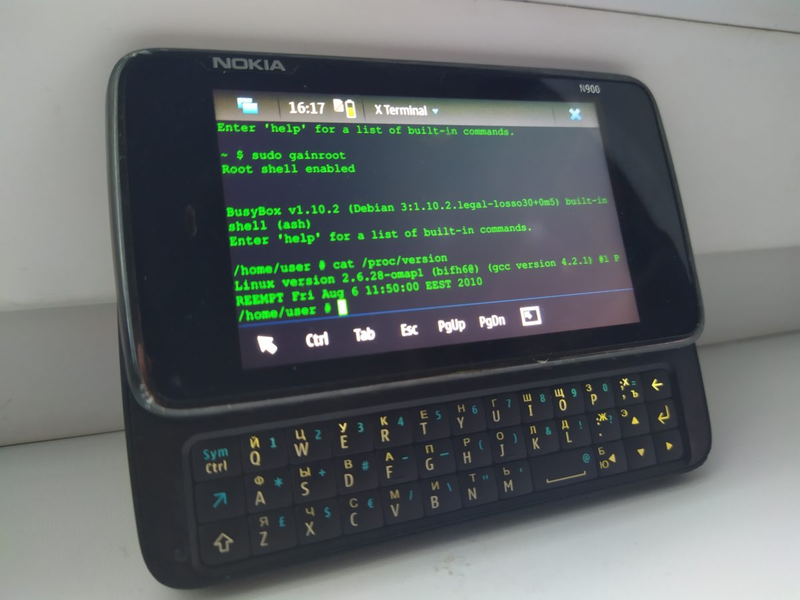

# (Backup) Nokia n900 Maemo 5 Repository

Backups .deb packeges & main Maemo 5 (Freemantle) repositories for Nokia N900


### About us:

Dear friends,

We understand that many of you, as owners of this device, face the issue of accessing the repositories. Due to this, it is impossible to update the list of packages and important tools needed for the device's operation.
In order to solve this issue, we have made a backup copy of the main repositories for the Nokia N900 with the Maemo 5 operating system (Fremantle distribution). This backup has been uploaded to our servers in Russia.

## The current addresses are:
```
# Nokia Fremantle APPS
Mirror 1: #deb http://repository.maemo.sbs/d/mirror1/downloads.maemo.nokia.com/fremantle/ssu/apps/
Mirror 2: #deb http://repository.maemo.sbs/d/mirror2/downloads.maemo.nokia.com/fremantle/ssu/apps/
Dist: ./
Components:

# NOKIA Fremantle SSU Update
Mirror 1: #deb http://repository.maemo.sbs/d/mirror1/downloads.maemo.nokia.com/fremantle/ssu/mr0/
Mirror 2: #deb http://repository.maemo.sbs/d/mirror2/downloads.maemo.nokia.com/fremantle/ssu/mr0/
Dist: ./
Components:

# NOKIA OVI
#deb http://repository.maemo.sbs/d/mirror1/downloads.maemo.nokia.com/fremantle1.2/ovi/
Dist: ./
Components:

# Maemo Extras
#deb http://repository.maemo.sbs/d/repository.maemo.org/extras/
Dist: fremantle
Components: free non-free

# Maemo Extras-Devel
#deb http://repository.maemo.sbs/d/repository.maemo.org/extras-devel/
Dist: fremantle
Components: free non-free

# Maemo Extras-Testing
#deb http://repository.maemo.sbs/d/repository.maemo.org/extras-testing/
Dist: fremantle
Components: free non-free

# Maemo SDK
#deb http://repository.maemo.sbs/d/repository.maemo.org/pool/fremantle/
Dist: fremantle/sdk
Components: free non-free

# Maemo Update2
#deb http://repository.maemo.sbs/d/repository.maemo.org/pool/fremantle-update2/
Dist: fremantle/sdk
Components: free non-free
```
 (list will be updated after server update)


Yours faithfully,
The Maemo Team

#### Site projects
* [Maemo.sbs](https://maemo.sbs/)

#### Donate
* Wallet USDT TRC20: TQUhqWL7Co4G5fGYYEiTY1CXn4BWvRaSMx
